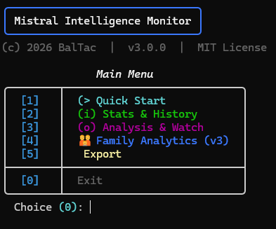
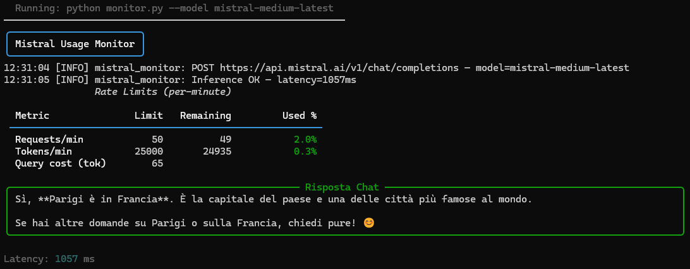
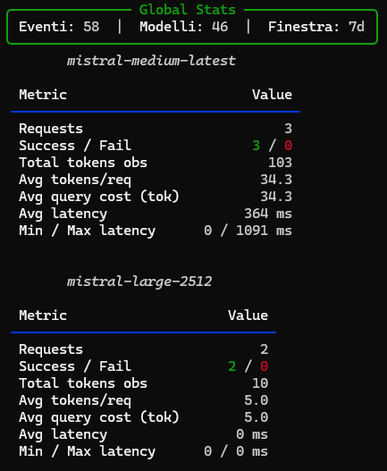
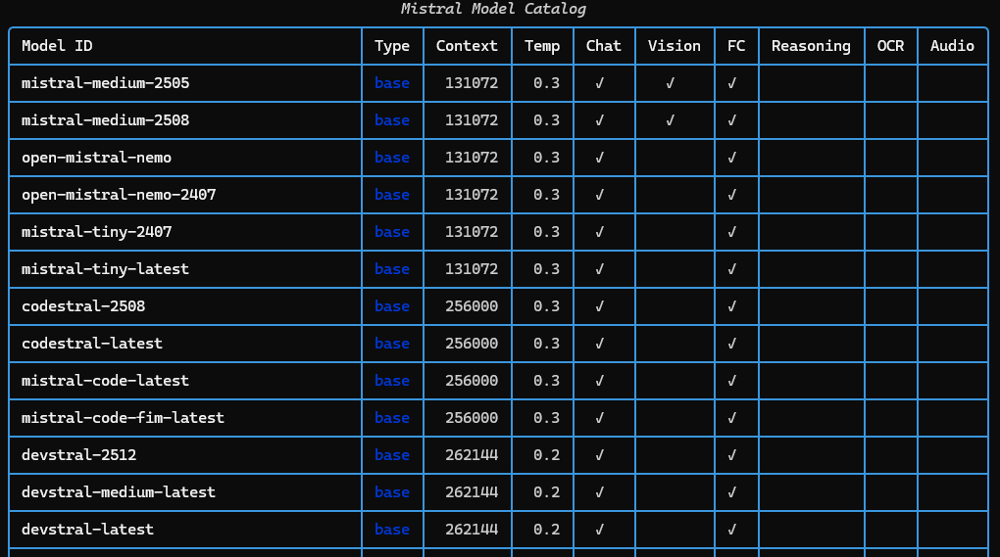

<p align="center">
  <picture>
    <source media="(prefers-color-scheme: dark)" srcset="https://img.shields.io/badge/Mistral%20Intelligence%20Monitor-v3.0.0-blue?style=for-the-badge&logo=python&logoColor=white&labelColor=1a1a2e">
    
  </picture>
</p>

<p align="center">
  
  
  
  
</p>

<br>

# Mistral Intelligence Monitor

> **Real-time API telemetry · Model inventory & classification · Family analytics · Anomaly detection**

Monitor, analyze, and track the Mistral AI ecosystem — rate limits, model catalog drift, capability fingerprints, and per-family infrastructure analytics — all from your terminal.

<br>

## 🎯 Background

Around the **second quarter of 2026**, Mistral AI introduced significant changes to their API infrastructure, migrating from legacy monthly quota headers to a new per-minute rate-limit system. The old monthly plan quotas — previously retrievable via API response headers — were deprecated, making it impossible to track usage against plan limits using the standard tooling.

This script was built to fill that gap. It reverse-engineers the new rate-limit headers (`x-ratelimit-limit-tokens-minute`, `x-ratelimit-limit-req-minute`, etc.), persists historical snapshots to SQLite for cumulative analysis, and adds model inventory tracking, capability fingerprinting, family normalization, and anomaly detection on top — turning a broken monitoring setup into a complete observability platform for the Mistral AI API.

> **Note:** All HTTP headers are optional — the script works even if Mistral changes their API again. The `raw_headers` forensic table logs every response header for future-proofing.

<br>

---

## 📸 Overview

<br>

<div align="center">
  <table>
    <tr>
      <td width="50%" align="center">
        <b>🚀 Launcher — Interactive Menu</b><br>
        <br>
        <sub><i>Rich TUI menu with 5 sections: Quick Start, Stats, Analysis, Family, Export</i></sub>
      </td>
      <td width="50%" align="center">
        <b>⚡ Inference Monitor</b><br>
        <br>
        <sub><i>Real-time rate-limit display, token usage, latency tracking</i></sub>
      </td>
    </tr>
    <tr>
      <td width="50%" align="center">
        <b>📊 Statistics Engine</b><br>
        <br>
        <sub><i>Aggregate stats, per-model metrics, trend analysis, export</i></sub>
      </td>
      <td width="50%" align="center">
        <b>📦 Model Catalog</b><br>
        <br>
        <sub><i>Discovery, classification (9 categories), family normalization, watch</i></sub>
      </td>
    </tr>
  </table>
</div>

<br>

---

## ✨ Features

| Area | Capabilities |
|---|---|
| **🔍 Discovery** | Model catalog with auto-classification (9 categories: EMBEDDING, CODING, GENERAL, REASONING, MULTIMODAL, AUDIO, MODERATION, AGENTIC, UNKNOWN) |
| **⚡ Telemetry** | Real-time rate-limit monitoring, per-request latency, token usage, success rates |
| **📈 Statistics** | Aggregate stats (today/7d/30d/all), per-model metrics, daily trends, request history |
| **👀 Watch** | Anomaly detection: models added/removed/changed, new HTTP headers, capability drift |
| **👪 Families (v3)** | Family normalization, alias/duplicate detection, per-family infrastructure analytics |
| **🧠 Classification** | Name-based heuristics → capability-based fallback → UNKNOWN |
| **💾 Persistence** | 6 SQLite tables, auto-migration, no setup required |
| **📤 Export** | CSV/JSON export for usage, inventory, and limits |
| **🕸️ Knowledge Graph** | [Graphify](https://github.com/safishamsi/graphify) integration — community detection, wiki, interactive HTML graph |
| **🎨 Launchers** | Interactive TUI (rich) · One-liner passthrough · CMD / bash / Python |

<br>

---

## 🚀 Quick Start

### 1. Setup

```bash
# Create virtual environment & install dependencies
python -m venv .venv
.venv\Scripts\activate      # Windows
source .venv/bin/activate    # Linux / macOS
pip install -r requirements.txt

# Set your API key
set MISTRAL_API_KEY=your_key_here    # Windows
export MISTRAL_API_KEY=your_key_here # Linux / macOS
```

### 2. Launch

```bash
# Interactive menu (recommended)
./launcher.sh                # bash / WSL
launcher.cmd                 # Windows CMD
python launcher.py           # any platform

# One-liner mode
python launcher.py --models                 # model catalog
python launcher.py --stats --window 7d      # last 7 days stats
python launcher.py --model mistral-large-latest  # single inference
```

### 3. Full pipeline

```bash
# Build inventory + rate limits
python mistral_monitor/monitor.py --test-all

# Analyze
python mistral_monitor/monitor.py --limits-report
python mistral_monitor/monitor.py --watch-report
python mistral_monitor/monitor.py --families
```

<br>

---

## 🔧 CLI Commands

| Command | Description |
|---|---|
| `--model NAME` | Single inference with rate-limit display |
| `--models` | Model catalog + inventory + classification |
| `--test-all` | Probe all models, build inventory + limits |
| `--limits-report` | Rate limits sorted by token/min |
| `--stats [--window N]` | Aggregate statistics (today/7d/30d/all) |
| `--per-model-stats` | Per-model latency, cost, success rate |
| `--history [N]` | Last N requests |
| `--trends` | Daily trend data |
| `--watch-report` | Model changes: added/removed/changed |
| `--duplicates` | Alias/duplicate detection |
| `--families` | Model family report with versions |
| `--stats-families` | Per-family infrastructure analytics |
| `--export csv\|json` | Export usage history |
| `--export-models csv\|json` | Export model inventory |
| `--export-limits csv\|json` | Export limits report |

<br>

---

## 🧠 Knowledge Graph

This project includes a complete [graphify](https://github.com/safishamsi/graphify) knowledge graph with community detection:

```
graphify-out/
├── graph.html        ← Interactive graph (open in browser)
├── graph.json        ← Raw data (GraphRAG-ready)
├── GRAPH_REPORT.md   ← Full audit report
└── wiki/             ← Agent-crawlable wiki (16 community articles)
```

Use it to explore codebase architecture, trace dependencies between modules, and discover cross-document connections.

<br>

---

## 📚 Documentation

For detailed documentation — architecture, database schema, family normalization logic, capability fingerprinting, changelog, and example reports — see:

> **[📖 Detailed README →](./mistral_monitor/README.md)**

Additional references:

| Document | Description |
|---|---|
| [`CHANGELOG.md`](./mistral_monitor/CHANGELOG.md) | v1.0.0 → v3.0.0 feature history |
| [`FAMILY_ANALYTICS_REPORT.md`](./mistral_monitor/FAMILY_ANALYTICS_REPORT.md) | Example family analytics output |
| [`MODEL_WATCH_REPORT.md`](./mistral_monitor/MODEL_WATCH_REPORT.md) | Example watch report output |
| [`test_mistral.py`](./test_mistral.py) | Standalone diagnostic script (no rich, no .env) |

<br>

---

<p align="center">
  <sub>
    <b>Mistral Intelligence Monitor</b> &mdash;
    (c) 2026 BalTac &middot;
    v3.0.0 &middot;
    <a href="./LICENSE">MIT License</a>
  </sub>
</p>
